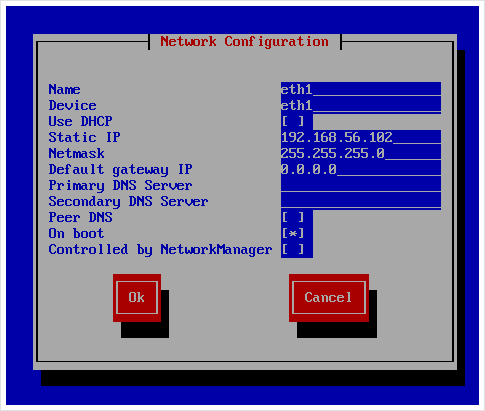

# Hadoop dev-env

>windows 10(__host__) + virtualbox(__host__) + hadoop on centos (__v__irtual__m__achine__s__) 
>
>goto [('Hadoop ecosystem')]() for building ecosystem along with hadoop
>
>goto [('Hadoop dockerized-dev-env')]() for further dockerization 


## components

* windows 10 (FTP Server)
* __virtualbox 6.1__
* __centos 6.10 minimal__
* __hadoop 2.7.7__
* __pig 0.17.0__


#### configuration / centos

- [x] add linux user for 'hadoop' and give sudoer authorization
- [x] 'NAT' + 'Host Only' network configuration : [(network-scripts)](#####network-stripts)
- [x] set up 'network-connection-by-name' : [(hostname)]() and [(local IP addresses mapping)]()
- [x] enable remote shell scripts execution : [(ssh configuration)]()
- [x] ftp client for file share between host and vms


#### configuration / hadoop

- [x] install jdk-1.8.0, hadoop-2.7.7, maven-3.6.3 + add global variables for runtime reference
- [x] install protocol buffer [(Protobuf-2.5.0)](), openssl-devel
- [x] hadoop native library compilation using Maven 


#### configuration / windows

- [x] enabling ftp services


##### *network-scripts

> both 'NetworkManager' and 'system-config-network-tui' tools will modify "/etc/sysconfig/network-scripts/ifg-[name of device]" <sup>1 INTERFACE CONFIGURATION FILES</sup>


* [x] yum install -y system-config-network-tui && system-config-network-tui




##### *GRUB

> GRand Unified Bootloader
> "/etc/grub.conf"


- [x] /etc/grub.conf

``` Shell
...
nomodeset rd_NO_LUKS LANG=en_US.UTF-8 rd_NO_MD SYSFONT=latarcyrheb-sun16 crashkernel=auto rd_LVM_LV=vg_hadoop2/lv_swap  KEYBOARDTYPE=pc KEYTABLE=us rd_LVM_LV=vg_hadoop2/lv_root rd_NO_DM rhgb quiet '''vga=791'''
...
```


##### *hostname

> "/etc/sysconfig/network"


- [x] /etc/sysconfig/network

``` Shell
NETWORKING=yes
HOSTNAME=hadoop1
```


##### *local IP addresses mapping

> "/etc/hosts"


- [x] /etc/hosts

``` shell
192.168.56.101 hadoop1
192.168.56.102 hadoop2
192.168.56.103 hadoop3
192.168.56.104 hadoop4
```


##### *ssh configuration

>ssh-keygen
>
>ssh-copy-id
>
>"~/.bashrc"
>
>"/etc/sysconfig/sshd/sshd_config"


- [x] ssh-keygen

``` Shell
$ ssh-keygen -t rsa
```


- [ ] ssh-copy-id

``` Sje;;
$ ssh-copy-id [ip address | hostname]
```


- [ ] ./bashrc (bash run commmands and/or bash run configuration)


- [ ] sshd (Secure SHell Daemon) configuration

``` shell
RSAAuthentication yes
PubkeyAuthentication yes
AuthorizedKeysFile .ssh/authorized_keys
UseDNS yes
```

``` shell
$ sudo service sshd restart
```


---

<sup>1 INTERFACE CONFIGURATION FILES</sup>: https://access.redhat.com/documentation/en-us/red_hat_enterprise_linux/6/html/deployment_guide/s1-networkscripts-interfaces

 

**_documented by sana-lucet_**