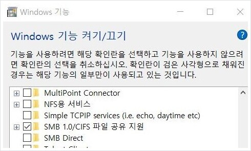
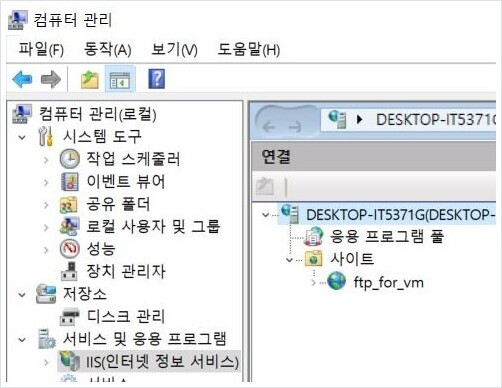
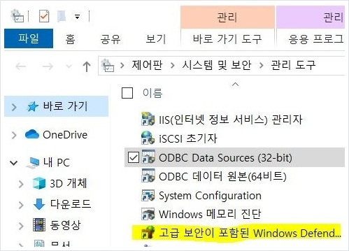

# Windows (host)

> setting up a FTP Server for file transfer from host to vm's
>
> goto ['FTP commands']()

## services

* FTP service

#### configuration / FTP service

> Turn Windows features on or off
>
> Computer Management
>
> Windows Management Instruments

- [x] Turn Windows features on or off 

- [x] Computer Management

- [x] Windows Management Instruments

_documented by sana-lucet_